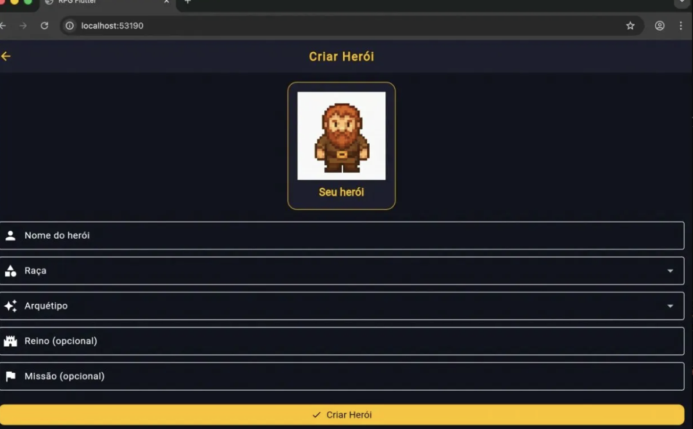
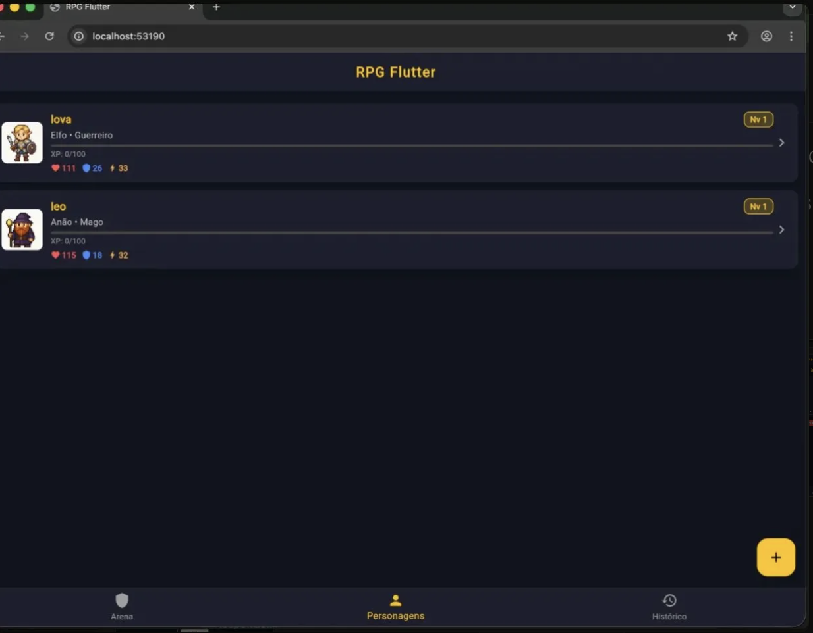
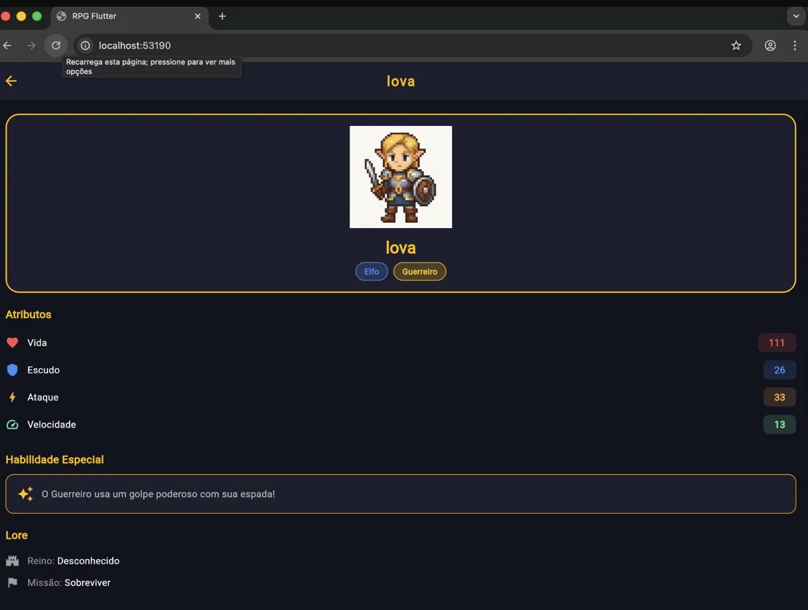
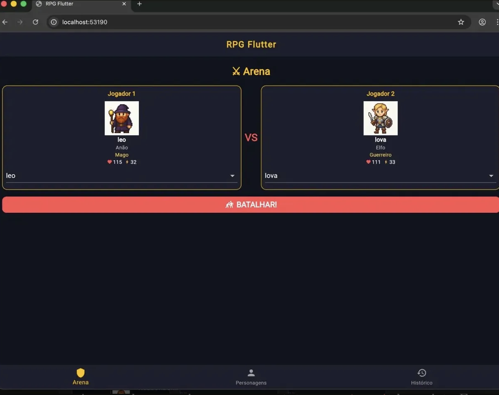
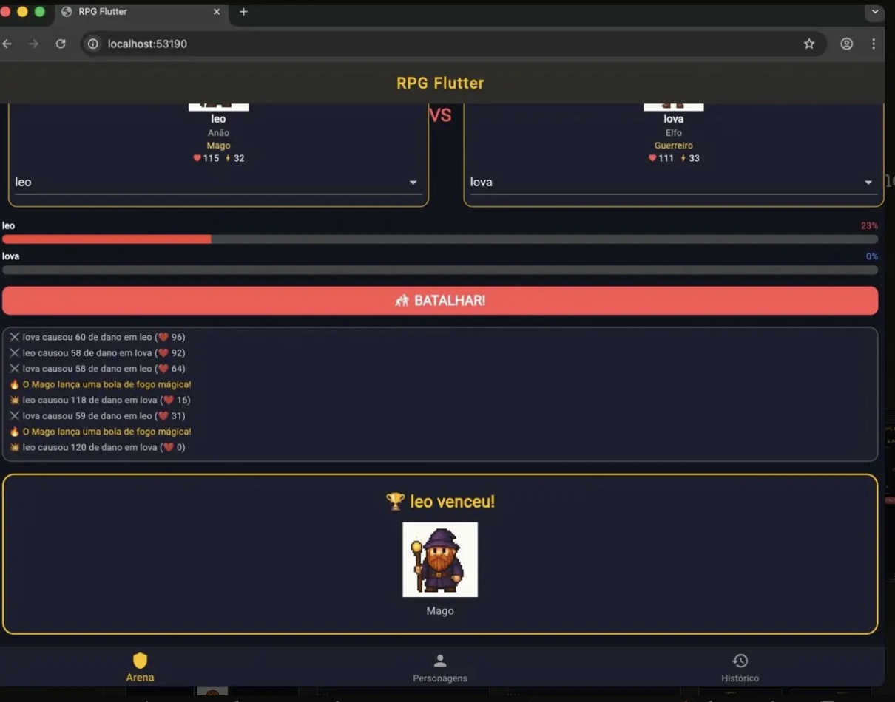

# ⚔️ RPG Flutter

Um jogo de RPG por turnos feito em Flutter.

## O que é

Um app mobile onde você cria heróis, escolhe raça e arquétipo, e os manda batalhar na arena. O sistema de combate é por turnos com dados, habilidades especiais e log de batalha em tempo real.

## Telas

### Cadastro de Herói

### Lista de Personagens

### Detalhes do Personagem

### Arena

### Resultado da Batalha

## Funcionalidades

- Criar heróis com nome, raça e arquétipo
- Cada combinação gera uma imagem diferente do personagem
- Batalha por turnos com barras de vida animadas
- Guerreiro bloqueia ataques, Mago causa dano dobrado, Arqueiro sempre ataca primeiro
- Sistema de XP e nível após batalhas
- Herói vs Herói e Herói vs Monstro
- Histórico de batalhas com placar e medalhas
- Deletar personagens deslizando o card

## Tecnologias

Flutter • Dart • Programação Orientada a Objetos
